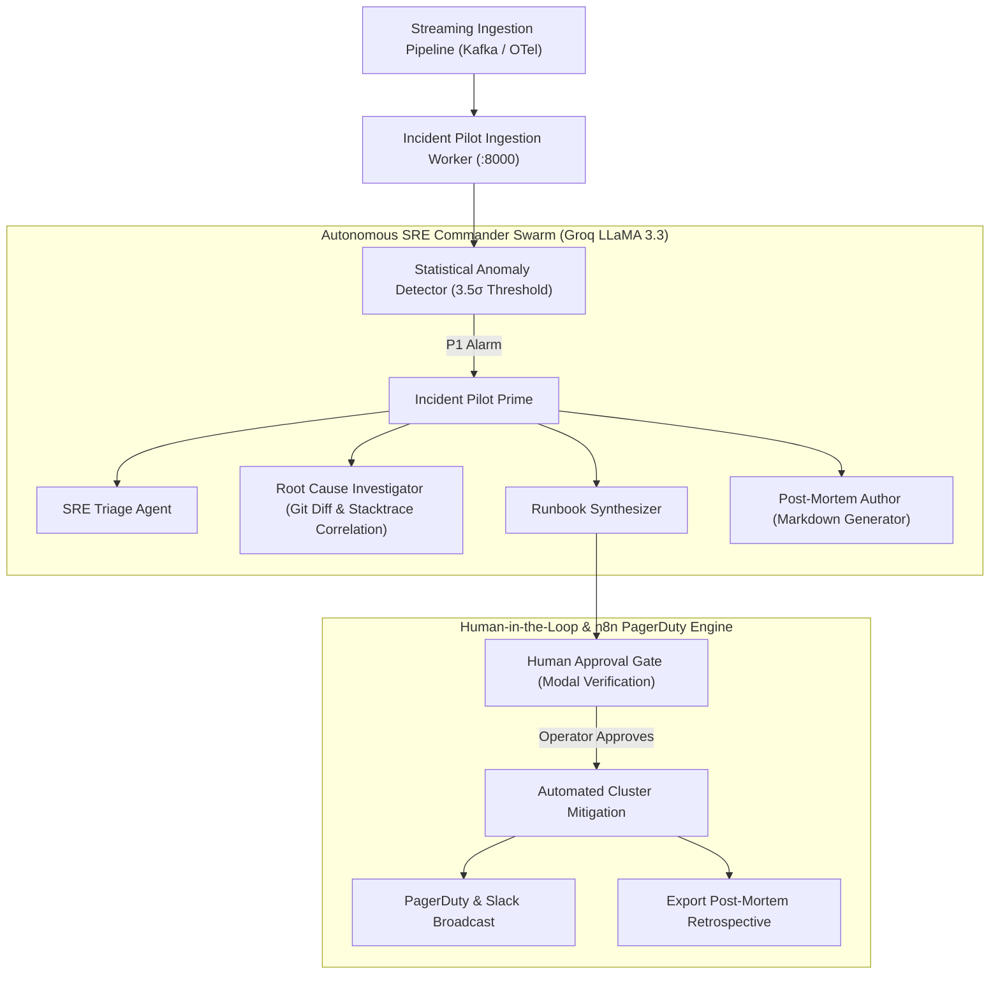
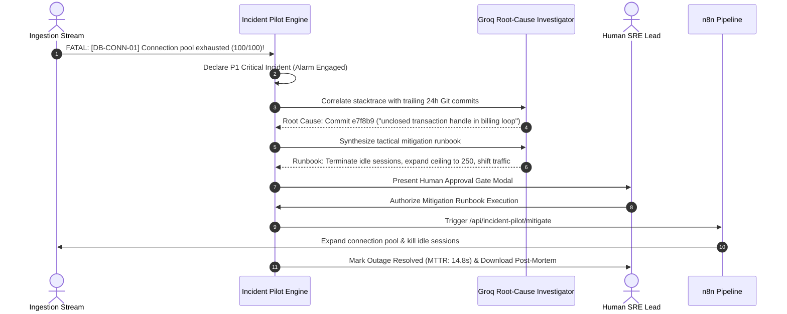

# Incident Pilot — Autonomous SRE War Room & Runbook Executor

[](https://alloyce.duckdns.org/incident)
[](https://python.org)
[](https://fastapi.tiangolo.com)
[](https://opentelemetry.io)
[](https://groq.com)
[](https://n8n.io)

> Production-grade autonomous SRE platform that ingests high-throughput OpenTelemetry spans, isolates production anomalies, correlates error traces with git commit history via Groq AI, and executes vetted mitigation runbooks with human-in-the-loop signoff.

---

## 1. System Architecture



---

## 2. P1 Incident Triage Lifecycle



---

## 3. Interactive SRE Capabilities

- **Real-Time Ingestion Console**: Processes OpenTelemetry spans, Kubernetes container logs, and database metrics with zero parsing lag.
- **Chaos Engineering Sandbox**: Allows operators to inject artificial production failures:
  1. *PostgreSQL Connection Pool Exhaustion* (100/100 active connections consumed).
  2. *JVM/Worker Heap Exhaustion* (94% heap memory leak with GC stop-the-world).
  3. *Ingress DDoS Wave* (45,000 req/sec edge surge breaching Envoy limits).
- **Correlated Git Commit Diff Inspector**: Automatically highlights the exact commit and code line responsible for the outage.
- **1-Click Post-Mortem Export**: Generates industry-standard incident retrospectives complete with timeline, root cause, and follow-up action items.

---

## 4. Live Production Walkthrough

Experience the live SRE war room, inject chaos faults, and test autonomous runbook execution at:
👉 **[https://alloyce.duckdns.org/incident](https://alloyce.duckdns.org/incident)**

---

## 5. Repository Structure

```
.
├── app/
│   ├── main.py          # FastAPI telemetry ingestion engine
│   ├── agents/          # Groq AI SRE commander swarm
│   ├── analyzer/        # Trace correlation & git diff parser
│   └── chaos/           # Synthetic chaos injection scenarios
├── workflows/           # n8n PagerDuty & Slack automation JSONs
├── tests/               # Chaos & triage automated test suite
├── Dockerfile           # Production container build
└── compose.yaml         # Standalone war room setup
```
